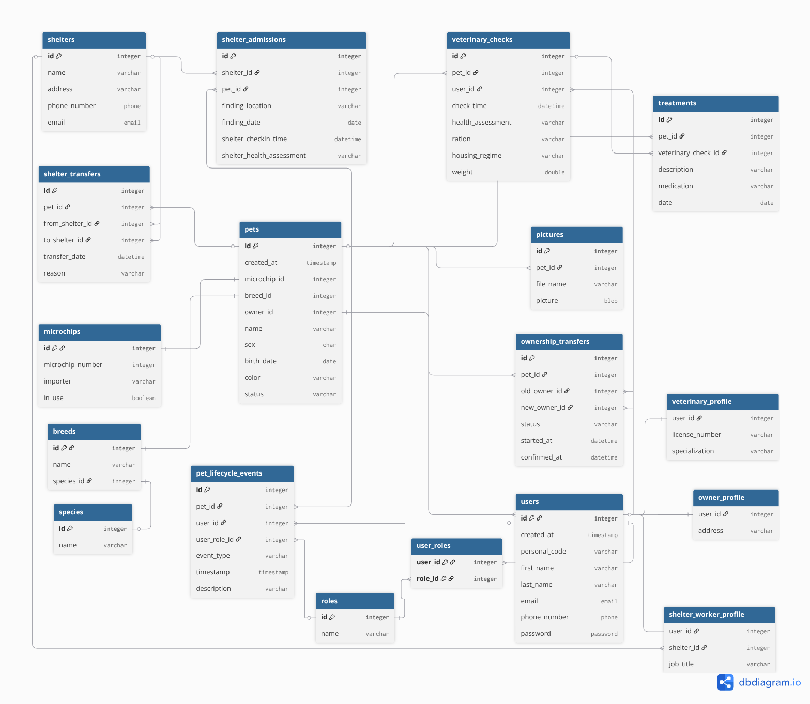

# Pet registry API protoype

A REST API for managing a pet registry using Spring Boot, JPA, and PostgreSQL.  
The system supports role-based access, pet lifecycle tracking, and structured data management.

**Tech stack**

- **Java**: 21
- **Spring Boot**: 4.0.3
- **Spring Data JPA** 
- **PostgreSQL**
- **Flyway database migration**
- **Spring Security (Basic Auth + Role based access)**
- **Angular (frontend)**

## Features

### Base features

Dedicated API endpoints exist for the following operations.
- **Role management**
    - All basic CRUD methods
- **User management**
    - All basic CRUD methods
- **Species management**
    - All basic CRUD methods
- **Breed management**
    - All basic CRUD methods
    - filtering breeds by species 
- **Microchip management**
    - All basic CRUD methods
    - filtering by microchip number
- **Pet management**
    - All basic CRUD methods
    - changing pet status and logging them
    - retrieving a pet's history

##  Authentication & Authorization

- Uses **HTTP Basic Authentication** (username:password), the username is the user's personal identification code
- Every request must include: X-Active-Role: ROLE_NAME (currently supported roles: OWNER, VET, ADMIN)
- If a user has multiple roles they can swap between the different views on the registry site
    - OWNER users can only see pets that belong to them, plus they can mark them deceased or lost.
    - VET users can register pets, register new microchips and check the list of all pets
    - ADMIN users can register new microchips, register new breeds (currently not implemented), manage users (currenly not implemented)

### Notes:

- Users can have multiple roles
- `X-Active-Role` defines the role used for the current request
- Backend validates that the user actually has that role

##  Database

- PostgreSQL is used as the database
- Schema is managed via **Flyway migrations**

Migration files are located in: `src/main/resources/db/migration`

Graph for the database tables and their connections (the shelter and veterinary+treatment ones still require implementation)

## Setup

### Prerequisites

- JDK 21
- PostgreSQL (14+ recommended)
- Maven (or use the included wrapper `mvnw`/`mvnw.cmd`)
- Node.js

### Installation

1. Clone the repository

```bash
git clone https://github.com/e5na/pet-registry-frontend.git 
git clone https://github.com/e5na/pet-registry-backend.git
```

2. Run the backend

On \*nix (if you have Maven installed):

```bash
mvn spring-boot:run
```

On \*nix (if you don't Maven installed):

```bash
./mvnw spring-boot:run
```

On Windows:

```bash
mvnw.cmd spring-boot:run
```

3. Run the frontend
   
In a second terminal you run `npm install` and `npm start`

After that, you can start with testing the API.

## Configuration

The build process is separated into two different builds or profiles in Spring jargon:
*dev* for development (default) and *prod* for production.

**What is the difference**?

The idea behind the separation is for the *dev* build to allow for quick development and testing. The *prod* build should be for data retention, but at the moment it removes debug logging, allowing for less clutter when working on a live database.
For development builds, the following has been enabled by default:

* extensive debug logging for executed SQL statements

> [!NOTE]
> All further examples use `mvn`, but if you don't have Maven installed on your system,
> you need to change it to the wrapper scripts `mvnw`/`mvnw.cmd` instead.

To switch to the production build, you need to specify it via the `-P` flag.

```bash
mvn spring-boot:run -Pprod
```

To seed sample data(and truncate the previous data) for testing you can run the command:

```bash
mvn spring-boot:run --Dspring-boot.run.arguments="--app.db.seed=true"
```
To access the backend directly, you can use Postman, but to access the frontend open the browser and go to ` http://localhost:4200 `

The seeded data provides you with an admin account whose login credentials are `00000000000:admin123`, the other seeded users all have the credentials `{personalCode}:password`
## Project layout

- `src\main\java\com\petreg\prototype` - application source code (controllers, entities, repositories,
  services etc.)
- `src\main\resources` - runtime configuration

## For future implementation

- Adding veterinary visits and treatments
- Adding shelter entities and shelter worker role to access them
- Adding automated testing for the API

## Authors

Marko Esna
\
Edwarth Pahk
\
Aleksei Pikkas
\
Rain Staub
